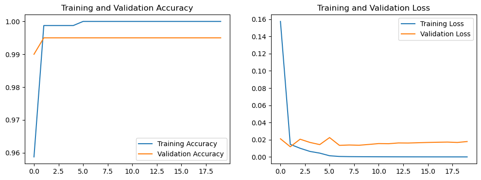

# Neural Network-Based Binary Classification of Handwritten Digits

 


<div align="center">
    
</div>

## Table of Contents

- [1. Introduction](#1-introduction)
  - [1.1. Project Objectives:](#11-project-objectives)
- [2. Environment Setup and Data Preparation](#2-environment-setup-and-data-preparation)
  - [2.1. Setting Up the Environment](#21-setting-up-the-environment)
  - [2.2. Loading and Preparing the Dataset](#22-loading-and-preparing-the-dataset)
- [3. Exploratory Data Analysis](#3-exploratory-data-analysis)
- [4. Model Architecture Design](#4-model-architecture-design)
  - [4.1. Model Architecture Summary](#41-model-architecture-summary)
- [5. Model Compilation and Training](#5-model-compilation-and-training)
- [6. Model Evaluation and Iteration](#6-model-evaluation-and-iteration)
- [7. Visualizing Predictions](#7-visualizing-predictions)
- [8. Conclusion](#8-conclusion)

### 1. Introduction

This project focuses on the application of neural networks to classify handwritten digits into binary categories, specifically digits 0 and 1. It is based on principles and methodologies taught in the Machine Learning Specialization by Andrew Ng, made available through DeepLearning.AI and Stanford Online. The goal is to demonstrate the foundational use of neural networks in machine learning through a practical, hands-on approach.


Employing the `TensorFlow` and `Keras libraries`, the project outlines the steps for building, training, and evaluating a neural network model capable of distinguishing between two classes of handwritten digits. This task serves as an entry point into the broader realm of machine learning and computer vision, illustrating key concepts such as data preprocessing, model architecture design, and the significance of hyperparameter tuning in improving model performance.

> - This project builds upon an assignment from the Machine Learning Specialization by Andrew Ng, utilized here for educational purposes and personal skill development.

---

#### 1.1. Project Objectives:

The primary objective of this project is to demonstrate the application of neural networks in solving a binary classification problem, specifically the classification of handwritten digits as 0 or 1.

Through this project, the following goals are pursued:

1. **Understanding Neural Network Basics**: To familiarize with the fundamental concepts of neural networks, including how they are structured, how they process information, and how they learn from data.

2. **Practical Application of TensorFlow and Keras**: To gain hands-on experience in using TensorFlow and Keras libraries for building and training neural network models. This includes setting up the environment, preparing the dataset, designing the model architecture, and configuring the training process.

3. **Data Preprocessing for Machine Learning**: To understand and implement the steps necessary for preparing data for machine learning models. This involves filtering the dataset, normalizing image pixel values, and reshaping images for the neural network.

4. **Model Evaluation and Interpretation**: To learn how to evaluate a neural network model's performance using accuracy metrics and to interpret the results to make informed decisions about model improvements.

5. **Code Syntax and Best Practices**: To improve familiarity with Python programming and TensorFlow/Keras syntax, emphasizing readability, efficiency, and adherence to best practices in coding. This includes understanding the rationale behind each code block, its role within the larger project context, and how similar principles can be applied to different machine learning tasks.

6. **Iterative Development and Learning**: To adopt an iterative approach to learning and development, where feedback from model performance is used to refine understanding, adjust model parameters, and improve outcomes progressively.

This project serves as a bridge between theoretical knowledge and practical application, aimed at enhancing the learner's skills in machine learning and neural network design.

---

### 2. Environment Setup and Data Preparation

#### 2.1. Setting Up the Environment

The project begins with the setup of the programming environment required for running the neural network model. Libraries such as `NumPy` for numerical computations, `Matplotlib` for visualizations, and, importantly, `TensorFlow` and its high-level API `Keras` are imported. These tools are central to building and training the model. To ensure reproducibility, random seeds for `NumPy` and `TensorFlow` are set, adhering to best practices in scientific experiments where consistent results are essential.


#### 2.2. Loading and Preparing the Dataset

The MNIST dataset, filtered to include only the digits 0 and 1, is utilized for this project. This filtering simplifies the problem to binary classification, focusing on distinguishing between these two digits.

The dataset undergoes several preprocessing steps, including normalization of pixel values to the [0, 1] range for improved training efficiency and reshaping of images from 2D arrays into flattened 1D vectors for input into the neural network.


---

### 3. Exploratory Data Analysis

Before training begins, a subset of the data is visualized to comprehend the variability in handwriting styles that the model aims to classify. This step confirms the quality of the data preparation and provides intuitive insight into the classification challenge.


---

### 4. Model Architecture Design

The foundation of the project is built on a neural network designed for binary classification, structured using TensorFlow's `Sequential` model as follows:

**Layer 0: Input Layer**
- **Functionality:** Prepares input data by flattening 2D image data into a 1D vector of 784 elements.
- **Details:** Sets the input shape to `(784,)`, essential for processing by subsequent layers.

**Layer 1: First Dense Layer**
- **Functionality:** Begins feature extraction from the input data, applying non-linear transformations.
- **Details:** Comprises 128 neurons, utilizes `ReLU` activation function for handling non-linearity.

**Layer 2: Second Dense Layer**
- **Functionality:** Continues to learn deeper representations from the features identified by the first layer.
- **Details:** Contains 64 neurons, also employing the `ReLU` activation function to support complex pattern learning.

**Layer 3: Output Layer**
- **Functionality:** Outputs a probability score indicating the likelihood the input image represents the digit 1.
- **Details:** Features a single neuron with a `sigmoid` activation function, ideal for binary classification tasks.


#### 4.1. Model Architecture Summary
Upon executing `model.summary()`, the model displays:

- A total of 108,801 trainable parameters.
- The first dense layer has 100,480 parameters (784*128 + 128 biases).
- The second dense layer contains 8,256 parameters (128*64 + 64 biases).
- The output layer includes 65 parameters (64*1 + 1 bias).

```plaintext
Model: "sequential"
_________________________________________________________________
Layer (type)                 Output Shape              Param #
=================================================================
dense (Dense)                (None, 128)               100480
_________________________________________________________________
dense_1 (Dense)              (None, 64)                8256
_________________________________________________________________
dense_2 (Dense)              (None, 1)                 65
=================================================================
Total params: 108,801
Trainable params: 108,801
Non-trainable params: 0
_________________________________________________________________
```

This succinct overview provides insight into the neural network's structure and its potential for learning from high-dimensional input through an optimized learning process.


---

### 5. Model Compilation and Training

The model architecture is compiled, specifying the `adam` optimizer and `binary_crossentropy` loss function, fitting choices for binary classification tasks. Training is conducted on the prepared dataset, with validation performed on a portion set aside to monitor overfitting. Accuracy on both the training and validation sets is tracked to gauge learning progress.

```python
model.compile(optimizer='adam', 
              loss='binary_crossentropy', 
              metrics=['accuracy'])

history = model.fit(X, y, 
                    epochs=20, 
                    batch_size=32, 
                    validation_split=0.2)

```

### 6. Model Evaluation and Iteration

Although a separate test dataset is not explicitly used, the validation split provides insight into the model's generalization ability. For a thorough evaluation in future iterations, the model ideally would be evaluated on an independent test set that has never been seen during training.

Visualization of the training process through accuracy and loss plots over epochs aids in identifying potential issues such as overfitting or underfitting.



The training process reached 100% accuracy on the training set quickly and maintained high validation accuracy at 99.5% across 20 epochs. The validation loss, despite minor fluctuations, remained low, indicating a well-fitting model. There is a slight divergence between training and validation loss, suggesting the possibility of overfitting, but the consistently high validation accuracy demonstrates the model's robustness.

---

### 7. Visualizing Predictions

The project concludes with a visual comparison of the model's predictions against true labels for a sample of the dataset. This visualization serves as a qualitative assessment of the model's performance and highlights the challenges and successes in distinguishing between the digits 0 and 1 based on handwriting styles.


### 8. Conclusion

This project established a basis for using neural networks for binary classification of handwritten digits, utilizing TensorFlow and Keras to demonstrate high accuracy and effective model training. Despite potential overfitting, consistent validation performance suggests a solid understanding of the task. The documentation aims to support further self-study and adaptation to evolving machine learning practices, highlighting the importance of feedback integration and methodological expansion.

[](https://www.linkedin.com/in/konstantinosjr)
